# EC2-Module-and-Security-Group-Module-with-Apache2-UserData

In this project, terraform will be used to create modularized configurations for Deploying an EC2 instance with a specified security group and Apacge2 installed using userdata.

## TASK 1 EC2 MODULE 

i. Create a new directory for your terraform project (e.g mkdir terraform-ec2-apache)

ii. Change into the directory (cd terraform-ec2-apapce)

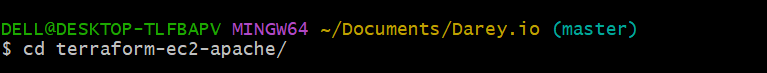

iii. Create directories for te EC2 and security modules ( mkdir -p modules/ec2 && mkdir -p modules/security-group)

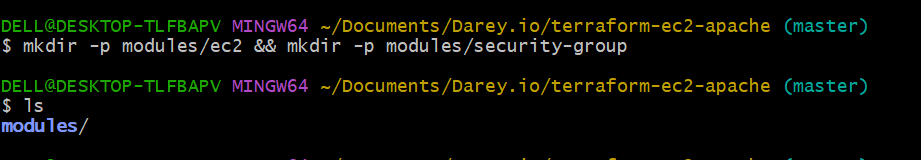

iv. Write the EC2 module configuration to create the EC2 instance 
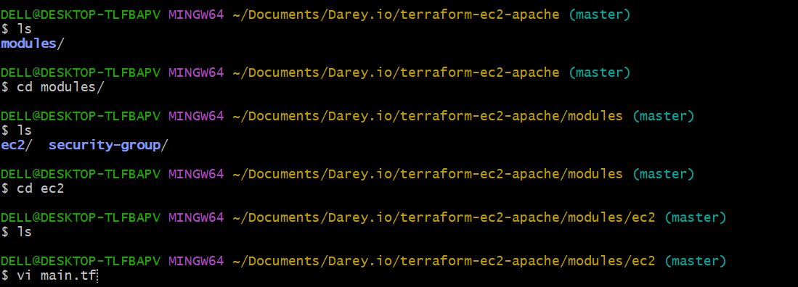

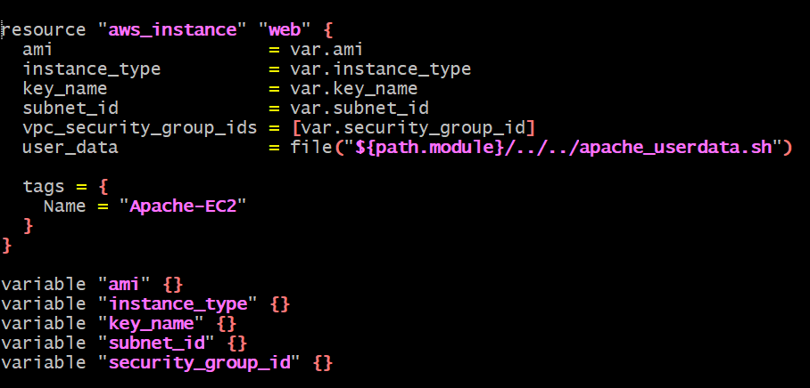

v. Write a security group module configuration to create a security group.

vi. Write a network module configuration

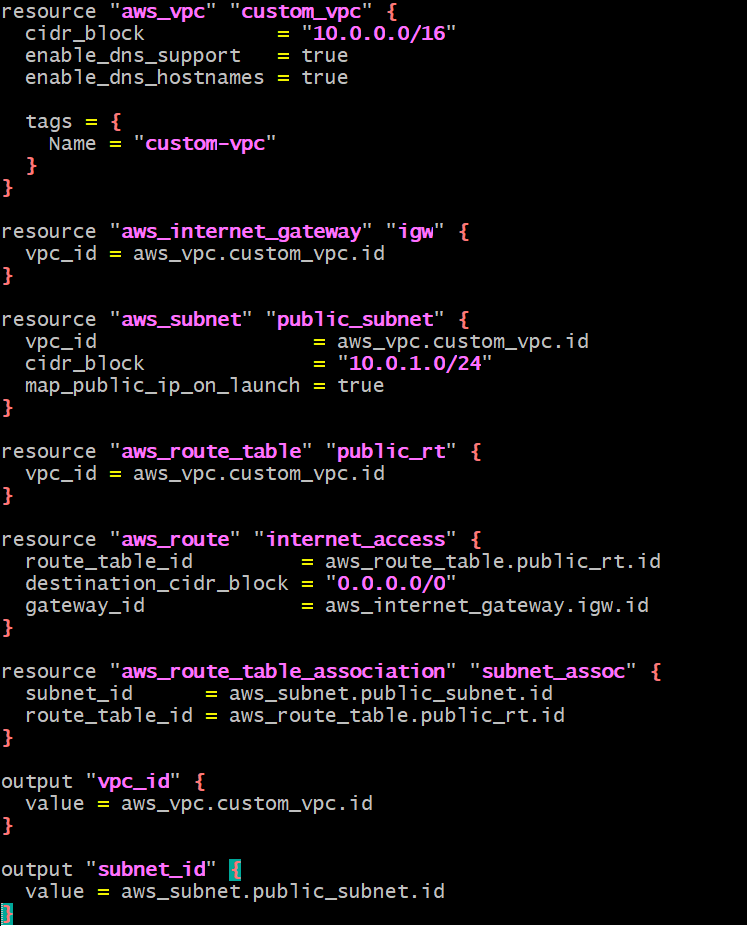

vii. Write the user data script tp install and configure the apache2 on the root directory.

``#!/bin/bash
sudo yum update -y
sudo yum install -y httpd
sudo systemctl start httpd
sudo systemctl enable httpd
echo "<h1>Hello World from $(hostname -f)</h1>" | sudo tee /var/www/html/index.html
``

And make it executable

``chmod +x``

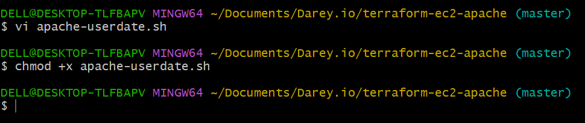

## MAIN TERRAFORM CONFIGURATION

Create the root main.tf to intergrate EC2 and security group modules. 

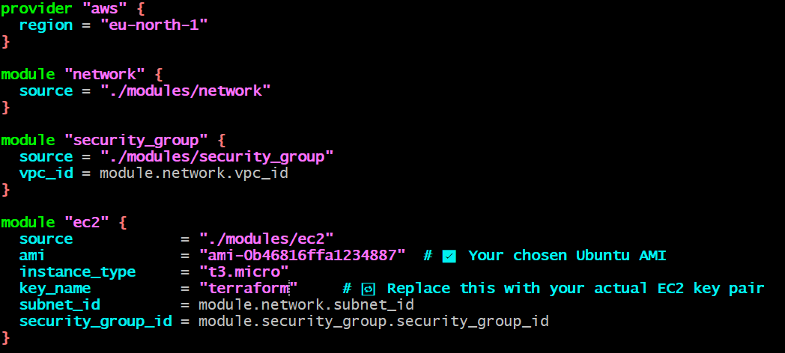

## INITIALIZE TERRAFORM

``terraform init``

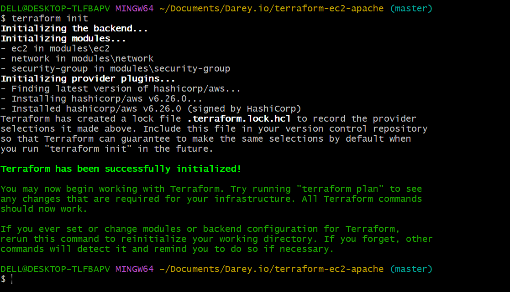

``terraform plan``

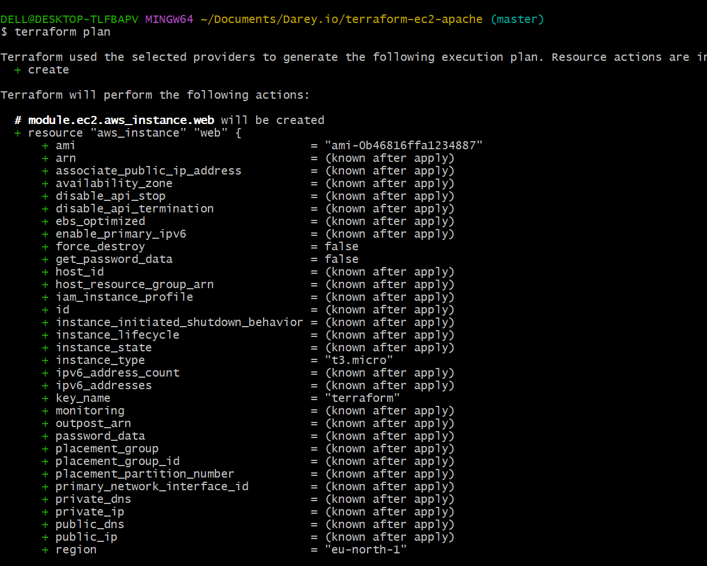

``terraform validate``

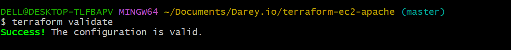

``terraform apply``

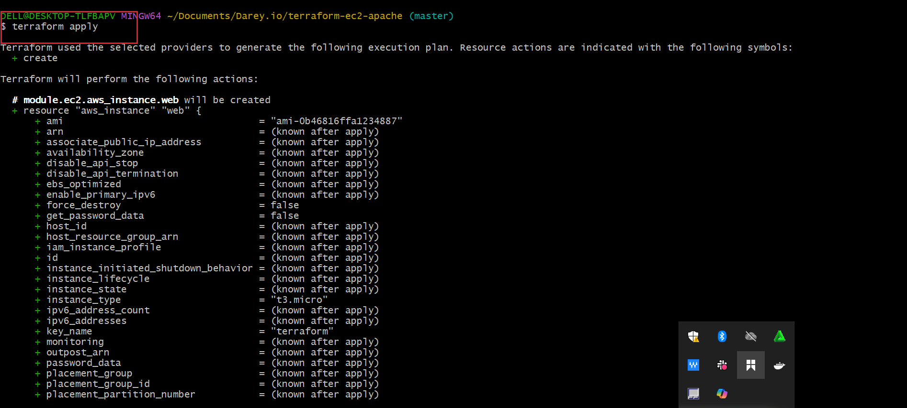

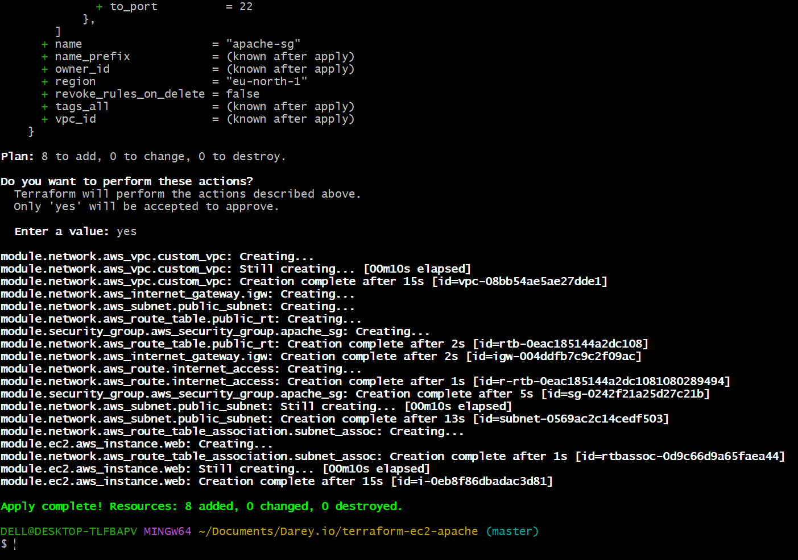

Access the ec2 using the public ip address and verify the apache2 is installed...

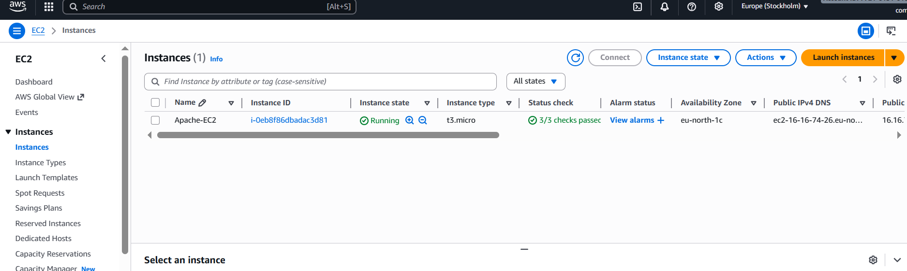

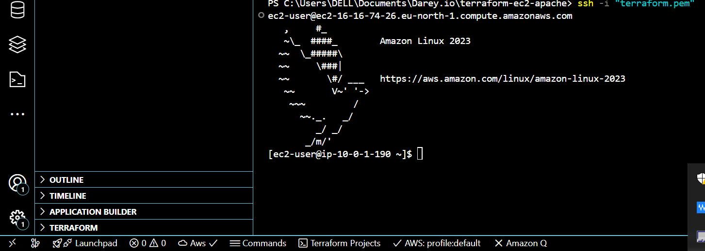

Apache up and running

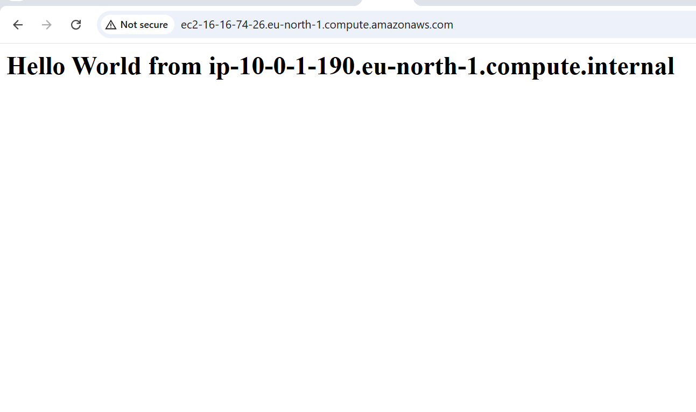

``terraform destroy``

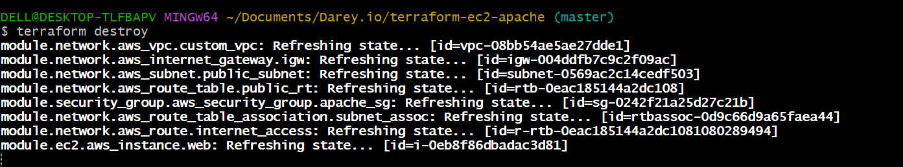

